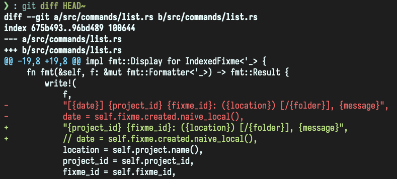
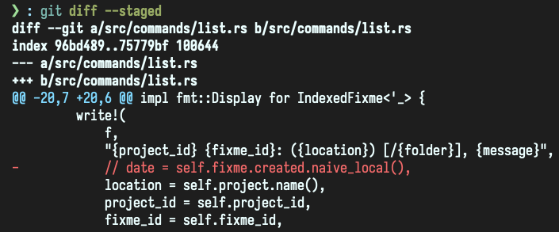
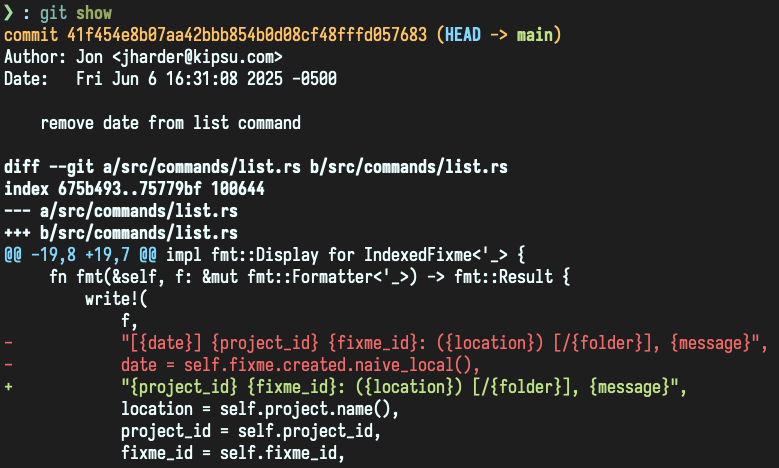

+++
date = '2025-06-06T14:26:06-05:00'
draft = false
title = 'Git Amend'
show_reading_time = true
tags = ['how-to', 'git']
+++

# Git Amend

## Introduction

In the last [post](/posts/git_reset) on our series on git, we
discussed how to `reset` a git commit.  Using `git reset` is great
when you realize you weren't quite ready to commit yet.  It will
remove the commit from history and take the modified files and put
them back into the index (or un-stage them, or remove them entirely
depending on what kind of reset you used)

Resetting is useful in this case, but often the reason you weren't
quite ready to commit was because you had an additional file to add,
or noticed a typo to fix.  In these cases, amending the commit is
nicer for a few reasons.

One reason it can be nicer to amend the commit is because it will
reuse the commit message so all your hard work crafting a [good commit
message](/posts/git_commit) won't get deleted when you reset.

But enough talk, let's look at examples.

## Amending commits

### Changing the content of a commit

```bash
git log --oneline origin/main..HEAD
```

```
* aaf149d (HEAD -> main) remove date from list command
```

In this example, we have one commit ahead of main. As we reviewed the
commit before sending it off for some coworkers to look at we realized
our change had some commented out code that isn't really needed.



We'd really like to remove the commented out code, but it would be
annoying to make another commit, and resetting the commit would erase
our _beautiful, thoughtful_ commit message.

Instead we can make the change and stage it:



And then... `git commit --amend --no-edit`

```
[main 41f454e] remove date from list command
 Date: Fri Jun 6 16:31:08 2025 -0500
 1 file changed, 1 insertion(+), 2 deletions(-)
```

If we look at the commit now we see no evidence of the commented out
code.  It's just gone, like it should have been from the start.



We used `--no-edit` to skip opening an editor to change the commit
message.  In this case, our amending the commit didn't change the
purpose or implementation of the work, so the message didn't need to
be changed.

> [!NOTICE] 
> Note that the commit sha is different.  Git didn't
> _change_ our last commit, it made a new one and took its place.
> This is important to understand, because it means that amending
> commits _changes history_.

### Changing the message of the commit

In the previous example, we noticed the _content_ of the commit
needing changing.  We used `git commit --amend --no-edit` because we
wanted to modify the contents but not the message of the commit.  If
the change to the content warranted a new message as well, we could
have simply left off the `--no-edit`.

But what about the opposite?  What if we want to change the commit
message but not the content?  Perhaps a reviewer noticed that your
commit message doesn't follow the project standards and needs more
information.

`git commit --amend` without any staged commits will open up your
configured editor allowing you to change the message.  When you exit,
the HEAD commit message will reflect your modifications.

> [!WARNING]
> This also changes history so similar cautions apply.

## Additional posts in this series

- [What makes a good commit](/posts/git_commit)
- [git reset](/posts/git_reset)
- [amend](/posts/git_amend) _(this post)_
- [fixup](/posts/git_fixup)
- interactive rebase
- I've made a time paradox, now what?
