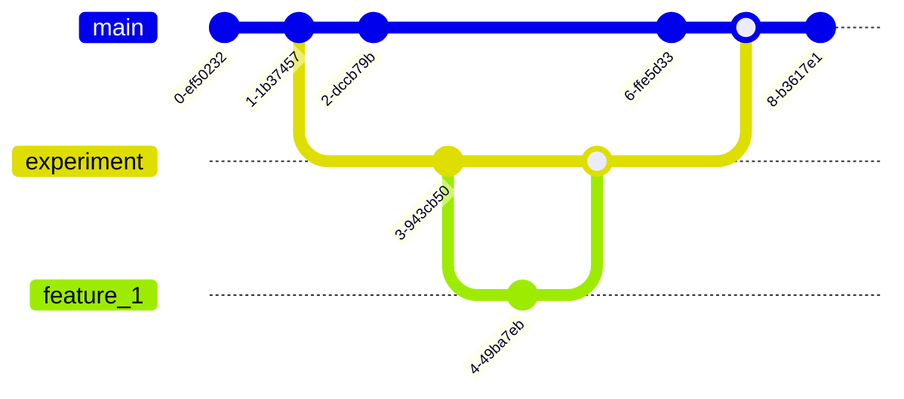

+++
date = '2025-01-23T14:57:00-06:00'
draft = true
title = 'Git Fixup'
show_reading_time = true
tags = ['how-to', 'git', 'fixup', 'reword', 'amend']
+++

## Introduction

This article begins our adventure into true git surgery. Up until now, though we
were technically changing history through commands like `reset`, we never really
changed history too drastically. We only ever changed the most recent commit in
the sense of performing an "undo" operation. We will now learn about how to
modify (but retain) the history of commits further back than the most recent
(`HEAD`) commit.

## Review

### Don't cause a time paradox

As a reminder, the git commands we are about to discuss will _change history_ in
your git repository. Refer to the article on
[git reset](/posts/git_reset#dont-cause-a-time-paradox) for how to change
history **safely**.

But as a reminder: local commits are safe (i.e. commits that haven't been pushed
to a remote). Mess them up. Re-order them. Delete them. If you're hoping to get
an initial batch of commits pushed to a remote for review without pushing
**ALL** commits from your branch, just provide the latest commit you'd like
reviewd. Say for example our work in on a branch called `featureA`, and our
commit history looks like this[^1]:

```bash
$ git log --oneline origin/main..HEAD 

* e8b6691 (HEAD -> featureA) Move Greeter logic to dedicated package
* 0c670f2 migrate greet func to struct Greeter
* 33baa3c Create go mod for project
```

As you can see, we have three commits, and by the lack of an `origin/featureA`,
our branch hasn't been pushed to our remote, `origin` yet. The first commit
introduces a new package in this go project, but perhaps we aren't sure if
that's the right call. We can push up just that commit and get feedback with the
following command:

```bash
$ git push origin 33baa3c:refs/heads/featureA

Enumerating objects: 5, done.
Counting objects: 100% (5/5), done.
Delta compression using up to 8 threads
Compressing objects: 100% (3/3), done.
Writing objects: 100% (4/4), 394 bytes | 394.00 KiB/s, done.
Total 4 (delta 0), reused 0 (delta 0), pack-reused 0 (from 0)
remote:
remote: Create a pull request for 'featureA' on GitHub by visiting:
remote:      https://github.com/JonHarder/git-test/pull/new/featureA
remote:
To https://github.com/JonHarder/git-test.git
 * [new branch]      33baa3c -> featureA
```

> [!NOTICE]
> the `refs/heads` syntax in only necessary because in our case, the branch
> doesn't exist yet on origin. It it did, we could simplify with the shortcut,
> `git push origin 33baa3c:featureA`

Now we can see that the first commit in our branch has been pushed to origin
(notice the `origin/featureA` part):

```bash
$ git log --oneline --graph origin/main..HEAD

* e8b6691 (HEAD -> featureA) Move Greeter logic to dedicated package
* 0c670f2 migrate greet func to struct Greeter
* 33baa3c (origin/featureA) Create go mod for project
```

### Recap `git reset`

Now if you recall the end of the article on [git reset](/posts/git_reset), we
can modify **the most recent commit** using `git commit --amend`. This takes
your changes and stages them as a new commit and throws away the old commit
you're amending, so you have **a totally new commit**. But what if the changes
you want to make aren't in the most recent commit? What if they're further back
in history?

## Modifying older commits

Say we were reviewing our work before sending it up for a pull request to get
peer reviewed and noticed a (contrived) issue. In commit
`0c670f2 migrate greet func to struct Greeter`, we changed the example code from
greeting "Steve" to "Bob". For consistency's sake, we'd like to change that back
to the original "Steve". Rather than making a new commit to change this, we'd
like to go back to the commit that introduced the change and amend that so that
it never changed in the first place.

To do this, we make our desired change and stage it...

```bash
emacsclient main.go
...
git add main.go
```

Now here's the new part. Git can make special commits that `fixup`, `amend`, or
`reword` target commits. When these special commits are read and applied by
`rebase` (more on that in a bit), it will replace the targeted commit with the
new staged files and/or commit message.

Reword will Update the targeted commit with a modified commit message, but
otherwise leave the files staged in that commit as they were.

Fixup will change the staged files in the targeted commit and replace it with a
new one, leaving the commit message as it was.

Amend will allow you to change both the staged files and the commit message.

In our case, the purpose of our targeted commit remains the same, we just want
to fix a small part of the code that was staged. To do this, we use the
`--fixup` flag on `commit`, providing the commit SHA of the commit we'd like to
fix.

```bash
$ git commit --fixup 0c670f2

[featureA 9ad8c32] fixup! migrate greet func to struct Greeter
 1 file changed, 1 insertion(+), 1 deletion(-)
```

We've made our fix, let's check out our log of changes on our feature branch:

```bash
$ git log --oneline origin/main..HEAD

9ad8c32 (HEAD -> featureA) fixup! migrate greet func to struct Greeter
e8b6691 Move Greeter logic to dedicated package
0c670f2 migrate greet func to struct Greeter
33baa3c (origin/featureA) Create go mod for project
```

We can see a new commit that starts with `fixup!` and shares the commit message
with our targeted commit. Now for how to replace the old commit with our new
fixup commit.

## Enter, rebase

`git rebase` is an increbibly powerful tool, but with great power comes great
responsibility (and opportunity to hurt yourself). We will cover all the many
cool things you can do with rebase in a dedicated article, but for now, we are
going to limit the interation to using it to automatically apply our special
fixup commits.

```bash
$ git rebase --autosquash --interactive origin/main
```

> [!NOTICE]
> We specified `origin/main` as the target because we wanted to
> include all commits starting from `origin/main` up to `HEAD`
> in the list git will rebase over.

This opens an editor with the following contents:

```git
pick 33baa3c Create go mod for project
pick 0c670f2 migrate greet func to struct Greeter
fixup 9ad8c32 fixup! migrate greet func to struct Greeter
pick e8b6691 Move Greeter logic to dedicated package

# Rebase 9c1125a..9ad8c32 onto 9c1125a (4 commands)
#
# ...(additional, informational content omitted)
```

If you've never seen this part of git before, don't worry; we're not going to
spend much time here (just yet). One thing to note however, is our fixup commit
has moved itself down below the commit it targeted, and the action git is going
to take on it has been changed from the default of `pick` to `fixup` (again,
don't worry much about the significance of this quite yet).

If we save the file and exit, git will perform the supplied actions on each
commit in order, picking (keeping) the commits marked with pick, and squishing
togethet the commit marked with fixup into the commit above it. So let's exit
and enjoy how easy that was.

```git
Auto-merging main.go
CONFLICT (content): Merge conflict in main.go
error: could not apply 9ad8c32... fixup! migrate greet func to struct Greeter
hint: Resolve all conflicts manually, mark them as resolved with
hint: "git add/rm <conflicted_files>", then run "git rebase --continue".
hint: You can instead skip this commit: run "git rebase --skip".
hint: To abort and get back to the state before "git rebase", run "git rebase --abort".
hint: Disable this message with "git config advice.mergeConflict false"
Could not apply 9ad8c32... fixup! migrate greet func to struct Greeter
```

The dreaded CONFLICT! Why did we ever try to rebase? It just ends in sadness. I
guess we'll just have to blow away the days work and start over with a fresh
clone of the repo....

Or do we?

## Fixing merge conflicts

TODO: reword and clean up

Merge conflicts arise when you attempt to merge two commits into one new one but
they both change the same line(s) of code. In our case, when we tried to `fixup`
our commit, we told git to merge two commits (the target commit and the fixed
commit) into one new commit. In our case, since we made staged the new changes
on a later commit that had modified the `NewGreeter` already, attempting to
unify our change from "Bob" to "Steve" also had repercussions as to the HEAD~1
commit, which migrated the `Greeter` struct into a separate package. So when we
fixed the earlier commit by changing the name, we are also trying to merge the
migration of the `Greeter` struct into the new package along with it.

Let's take a peek at the conflicting file and see if we can make sense of the
exact issue and what to do about it.

```go
package main

import "fmt"

type Greeter struct {
	name string
}

func NewGreeter(name string) *Greeter {
	return &Greeter{
		name: name,
	}
}

// greet takes a name and prints a greeting.
func (g *Greeter) greet() {
	fmt.Printf("Hello, %s\n", g.name)
}

func inc(i int) int {
	return i + 1
}

// / This is the main method.
func main() {
<<<<<<< HEAD
	greeter := NewGreeter("Bob")
||||||| parent of 9ad8c32 (fixup! migrate greet func to struct Greeter)
	greeter := greeter.NewGreeter("Bob")
=======
	greeter := greeter.NewGreeter("Steve")
>>>>>>> 9ad8c32 (fixup! migrate greet func to struct Greeter)

	greeter.greet()
	fmt.Printf("4 incremented is %d\n", inc(3))
}
```

This is showing us three versions of the file, using `<<<<`, `||||`, `====`, and
`>>>>` to deliniate the defferent contents of each version. This is the first
conflicting part:

```go
<<<<<<< HEAD
	greeter := NewGreeter("Bob")
||||||| parent of 9ad8c32 (fixup! migrate greet func to struct Greeter)
```

The HEAD part on the line starting with `<<<<<<<` states that this version was
on the HEAD commit. If we run `git log --oneline -n 1`, we can see the HEAD
commit is:

```
0c670f2 (HEAD) migrate greet func to struct Greeter
```

Hey, that's our target commit! This tells us git has (temporarily) traveled to
the past. So as of right now the first section of the conflicting file shows us
what the the file looked like when it was staged in our target commit. Git has
rolled back time and tried to merge our fixup commit with the target commit, but
it couldn't do so succesfully because we have conflicting versions.

The next conflict section starts is the part between these two markers:

```go
||||||| parent of 9ad8c32 (fixup! migrate greet func to struct Greeter)
	greeter := greeter.NewGreeter("Bob")
=======
```

`9ad8c32` was our fixup commit, and our rebase editor told us that when we
rebased, it moved our fixup commit in time to be right after our target commit



## References

- [Pro Git](https://git-scm.com/book/en/v2/Git-Tools-Rewriting-History)

## Footnotes

[^1]: The following is an example of a
    [revision range](https://git-scm.com/book/en/v2/Git-Tools-Revision-Selection)
    syntax; it means, _"show me the commits reachable from `HEAD` commit but not
    in `main`."_ In other words, _"all the commits on your local branch that
    have diverged from `main`."_
