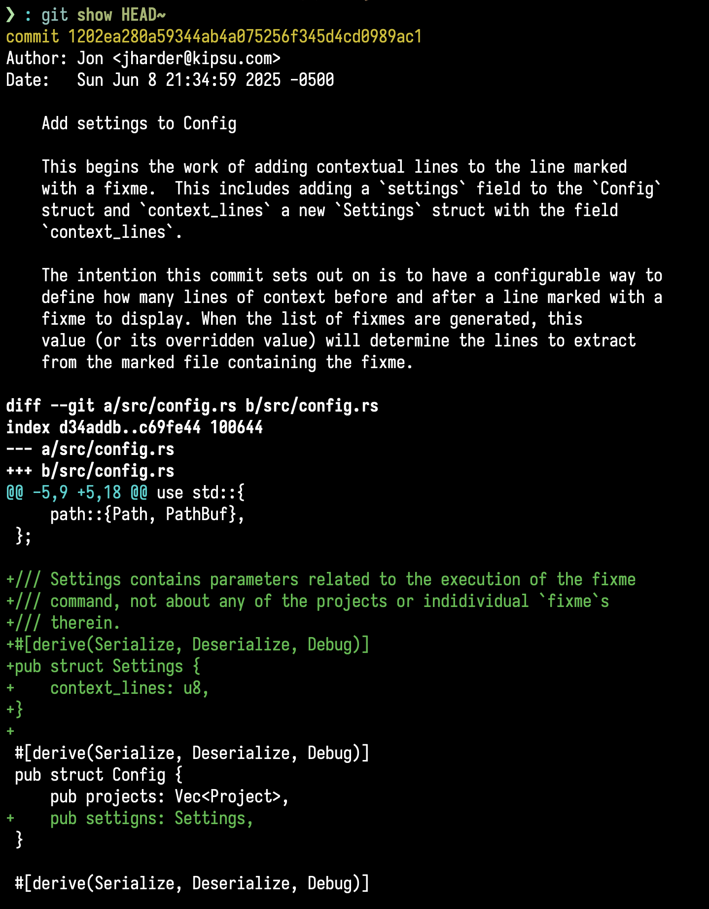

+++
date = '2025-06-16T16:30:00-05:00'
draft = false
title = 'Git Fixup'
show_reading_time = true
tags = ['how-to', 'git', 'fixup', 'reword', 'amend']
+++

## Introduction

This article begins our adventure into true git surgery. Up until now,
though we were technically changing history through commands like
`reset` and `commit --amend`, we never really changed history too
drastically. Furthermore, we only ever changed the most recent commit.
We will now learn about how to modify (but retain) the history of
commits further back than the most recent (`HEAD`) commit.

## Review

### Don't cause a time paradox

As a reminder, the git commands we are about to discuss will _change history_ in
your git repository. Refer to the article on
[git reset](/posts/git_reset#dont-cause-a-time-paradox) for how to change
history **safely**.

But as a reminder: local commits are safe (i.e. commits that haven't been pushed
to a remote). Mess them up. Re-order them. Delete them. If you're hoping to get
an initial batch of commits pushed to a remote for review without pushing
**ALL** commits from your branch, just provide the latest commit you'd like
reviewed:

```shell
git push origin <commit-id>:mybranch
```

This allows reviewer to look at your work in progress without the fear
of having your work in progress commits pushed to a remote.

## Changing a prior commit

### Fixing the commit

For our example, we will work off of a branch which is a few commits
ahead of our `main` branch:


And say we wanted to change the commit `cf70664` which looks like
this:


We can't reset to this point without undoing the commit that came
after it. We just want to add a doc string to the `Settings` struct.
Are we stuck?  Will we have to resort to just adding another commit?

No, we have `commit --fixup`!

Let's make the changes we want and stage them.


Then we commit using the `fixup` flag and specify the commit we want
to modify.  In our case, this is `cf70667 Add settings to Config`.


Let's look at the log and see what this just did.


Interesting. It made a new commit. I thought we wanted to _modify_ an
older commit...  Well we will. It just takes a couple of steps[^2].

Reading the man page on `--fixup` (found using `man gitcommit`)
has this to say about handling fixup commits:

```
--fixup=[(amend|reword):]<commit>
	Create a new commit which "fixes up" <commit> 
	when applied with git rebase --autosquash...
```

So it sounds like our changes will be applied when we run a `git
rebase` command.  Rebasing is a complicated subject and will get
multiple articles dedicated to it, but for now all we need to know is
that you can pass a `--autosquash` flag and it should just magically
do what we want.  

What the docs don't mention clearly is that we need to specify a
commit reference indicating how far back we want the rebase to go when
selecting which commits to rebase.  If you remember in our `git log`
from earlier, we were working on a branch with two commits ahead of
`main`.  So if we tell `rebase` to take `main` as the starting point
and tread all reachable commits from `main` until our `HEAD` commit we
should include both the commit we want to modify, _and_ the fixup
commit which modifies it.

### Rebasing our commits


Wait..._that's it?_  We just **rebased**.  I was ready for merge conflicts.
I though git was going to [detach my
head](https://www.cloudbees.com/blog/git-detached-head) or something.

Let's look at our commit history and see what just happened.


And let's see the contents of our targeted commit:



It looks just like our history before we made the fixup commit...

But not quite.

The contents are updated with our staged updates adding a doc string
to the `Settings` struct.  But that's not the only thing that changed.

When we made the fixup commit, we targeted the commit with the subject
"Add settings to Config", with the commit id `cf70664`.  Now, we still
have a commit with the same subject, but the commit id is different,
`1202ea2`.

We **changed history**.  This is not the same commit as the one we
looked at before.  Under the hood, git didn't modify the commit, it
made a new one that looks very similar to the old one and then
replaced the old one with the new one.

This is important to keep in mind because it means that if the older
commit was already pushed to a remote, you couldn't cleanly push this
new one.  According to git, you would have a commit your remote
doesn't have (the modified doppelganger commit), and the remote would
have a commit you don't have (the old, obsolete commit we threw away).

### Pushing our changes

In our example, none of our changes had been pushed to a remote so we
don't need to worry about the fact that we changed history; it was
local to our machine anyway so no one has to know.  But if we _had_
pushed our changes to a remote before running our rebase, we'd have a
little wrinkle to smooth our before our changes could get pushed.

If you tried to push your changes, it would fail and git would
_helpfully_ give you suggestions on how to fix it.

HOWEVER:


The answer, contrary to git's suggestions, is **NOT** to pull first
because you will just be pulling down a copy of the old commit you got
rid of; this will likely result in a conflict and will be confusing to
resolve.

In this case, you will need to force push your changes to the remote.

`git push origin --force-with-lease`

You may already be familiar with the `--force` flag when pushing with
git. This will overwrite the remove history with your local
history. This is what we want, but it can be dangerous because someone
else may have pushed up some commits to the destination branch.  If
you force pushed in this scenario, you'd be overwriting _their_
history too!

`--force-with-lease` checks for this situation and will happily
overwrite **your** history, but will fail if it would overwrite
someone else's history that you don't have locally.  This is exactly
what we want in this case.

## Other options with `--fixup`

Similar to our last article in the series on [git commit
--amend](/posts/git_amend), you can choose _how_ you want to modify
the commit. We just discussed using the plain `--fixup` flag, which
**only** changes the contents of an arbitrary commit.  But we can also
change the contents **and** the message by using
`--fixup=amend:<commit>`, or **only** the message using
`--fixup=reword:<commit>`.

For any of these variations, the process is still the same; a special
commit will be created, and it will be applied when you run `git
rebase --autosquash <branch>.`

## Conclusion

To modify an older commit (not the commit that `HEAD` points to): 

1. find the commit hash id
2. make your desired change and stage it (`git add ...`)
3. then run `git commit --fixup=<commit>`
4. finally, run `git rebase --autosquash <branch>`

Modifying commits doesn't need to be scary, and in fact, it can
improve the quality of your code.  If a commit needed some improvement
to accomplish what it set out to do.  Adding _another_ commit to
address the gap means your codebase has one incomplete commit, and
another that makes little sense as a stand alone change.  Modifying
the commit makes it actually do what it was supposed to do in the
first place.

### Additional posts in this series

- [What makes a good commit](/posts/git_commit)
- [git reset](/posts/git_reset)
- [amend](/posts/git_amend)
- [fixup](/posts/git_fixup) _(this post)_
- interactive rebase
- I've made a time paradox, now what?


### References

- [Pro Git](https://git-scm.com/book/en/v2/Git-Tools-Rewriting-History)

# Footnotes

[^1]: The following is an example of a
    [revision range](https://git-scm.com/book/en/v2/Git-Tools-Revision-Selection)
    syntax; it means, _"show me the commits reachable from `HEAD` commit but not
    in `main`."_ In other words, _"all the commits on your local branch that
    have diverged from `main`."_

[^2]: we will learn about an easier, quicker way to do this in a future article
